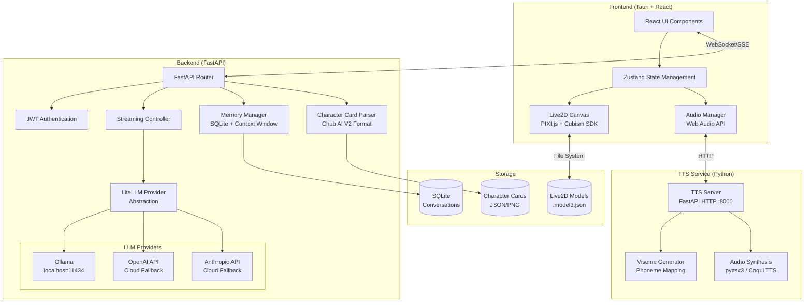
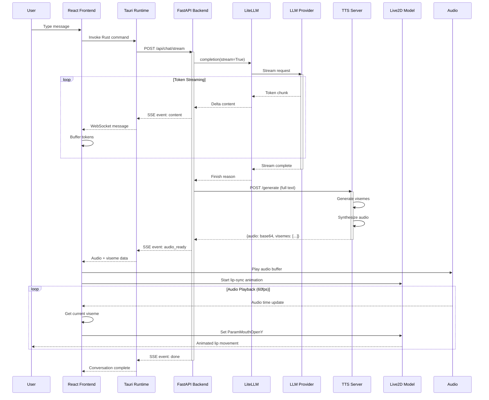

# AI Companion 🤖

[](https://opensource.org/licenses/MIT)
[](https://www.python.org/downloads/)
[](https://nodejs.org/)
[](https://rust-lang.org)

> **Privacy-first AI companion** with Live2D avatars, persistent memory, and local LLM inference. Built with **FastAPI**, **Tauri**, and **LiteLLM** for a secure, performant, and cross-platform experience.

## 🌟 Features

- 🔒 **100% Privacy-First** - All data stays local, no external API calls or telemetry
- 🎭 **Live2D Avatars** - Interactive 2D characters with lip-sync, expressions, and physics
- 🧠 **Multi-Provider LLM** - Ollama, OpenAI, Anthropic support via LiteLLM with automatic fallback
- 💭 **Persistent Memory** - SQLite-based conversation history with context window management
- 🔊 **Real-time TTS** - Local text-to-speech with synchronized lip-sync animation
- ⚡ **Streaming Architecture** - Real-time LLM token streaming with chunked audio delivery
- 🛡️ **Enterprise Security** - JWT authentication, rate limiting, CSP headers, input sanitization
- 🖥️ **Cross-Platform** - Windows, macOS, Linux via Tauri (Rust-based desktop framework)

---

## 🏗️ Architecture

### System Overview



### Streaming Architecture (LLM + Audio)



### Data Flow - Streaming Implementation

```mermaid
flowchart LR
    subgraph Input["User Input"]
        Text[Text Message]
        Character[Character Context]
    end

    subgraph Processing["FastAPI Processing"]
        Sanitize[Input Sanitization<br/>XSS/Injection Check]
        Context[Build Context<br/>Memory + Character Card]
        Stream[LiteLLM Stream]
    end

    subgraph Delivery["Chunked Delivery"]
        SSE[Server-Sent Events<br/>text/event-stream]
        Buffer[Token Buffer<br/>Frontend Accumulation]
        Complete[Full Response]
    end

    subgraph Audio["Audio Pipeline"]
        TTS_Request[TTS Request<br/>Parallel Processing]
        Viseme_Map[Phoneme → Viseme<br/>Mapping Table]
        Audio_Sync[Audio-Viseme Sync<br/>Timestamp Alignment]
    end

    subgraph Output["Live2D Output"]
        Decode[AudioContext Decode]
        Playback[Audio Playback]
        LipSync[ParamMouthOpenY<br/>Real-time Updates]
        Render[Canvas Rendering<br/>60fps]
    end

    Text --> Sanitize
    Character --> Context
    Sanitize --> Context
    Context --> Stream
    
    Stream -->|Token chunks| SSE
    SSE -->|text/event-stream| Buffer
    Buffer --> Complete
    
    Complete --> TTS_Request
    TTS_Request -->|Parallel| Viseme_Map
    Viseme_Map --> Audio_Sync
    
    Audio_Sync --> Decode
    Decode --> Playback
    Playback -->|onTimeUpdate| LipSync
    LipSync -->|Set Parameter| Render
    Render -->|60fps| Live2D
```



---

## 🚀 Quick Start

### Prerequisites

Before starting, ensure you have:

| Software | Version | Purpose | Download |
|----------|---------|---------|----------|
| **Node.js** | 18+ | Frontend build system | [nodejs.org](https://nodejs.org/) |
| **Python** | 3.10+ | Backend & TTS service | [python.org](https://www.python.org/downloads/) |
| **Rust** | 1.70+ | Tauri desktop runtime | [rust-lang.org](https://www.rust-lang.org/tools/install) |
| **Git** | Any | Version control | [git-scm.com](https://git-scm.com/) |

### Platform-Specific Setup

#### Windows

```powershell
# 1. Install Node.js (includes npm)
# Download from https://nodejs.org/ and run installer

# 2. Install Python
# Download from https://python.org/ 
# Check "Add Python to PATH" during installation

# 3. Install Rust
Invoke-WebRequest -Uri https://win.rustup.rs -OutFile rustup-init.exe
.\rustup-init.exe -y

# 4. Verify installations
node --version    # v18.x.x
npm --version     # 9.x.x
python --version  # Python 3.10.x
cargo --version   # cargo 1.70.x
```

#### macOS

```bash
# 1. Install Homebrew (if not installed)
/bin/bash -c "$(curl -fsSL https://raw.githubusercontent.com/Homebrew/install/HEAD/install.sh)"

# 2. Install prerequisites
brew install node@18 python@3.10 rust

# 3. Verify installations
node --version    # v18.x.x
python3 --version # Python 3.10.x
cargo --version   # cargo 1.70.x
```

#### Linux (Ubuntu/Debian)

```bash
# 1. Update package list
sudo apt update

# 2. Install Node.js
# Using NodeSource
# (Note: This command adds NodeSource repository. This is a standard installation step.)
curl -fsSL https://deb.nodesource.com/setup_18.x | sudo -E bash -
sudo apt install -y nodejs

# 3. Install Python
sudo apt install -y python3.10 python3.10-pip python3.10-venv

# 4. Install Rust
curl --proto '=https' --tlsv1.2 -sSf https://sh.rustup.rs | sh
source $HOME/.cargo/env

# 5. Install system dependencies for Tauri
sudo apt install -y libwebkit2gtk-4.0-dev build-essential curl wget file libssl-dev libgtk-3-dev libappindicator3-dev librsvg2-dev

# 6. Verify installations
node --version     # v18.x.x
python3 --version  # Python 3.10.x
cargo --version    # cargo 1.70.x
```

---

## 📦 Installation

### Step 1: Clone Repository

```bash
git clone https://github.com/yourusername/ai-companion.git
cd ai-companion
```

### Step 2: Install Frontend Dependencies

```bash
# Install Node.js dependencies (Tauri + React)
npm install
```

### Step 3: Install Backend Dependencies

```bash
# Create Python virtual environment
python -m venv venv

# Activate virtual environment
# Windows:
venv\Scripts\activate
# macOS/Linux:
source venv/bin/activate

# Install Python dependencies
pip install fastapi uvicorn litellm pyttsx3 websockets pyaudio numpy python-multipart python-jose[cryptography] passlib[bcrypt]
```

### Step 4: Configure Environment

```bash
# Copy example environment file
cp .env.example .env

# Generate secure JWT secret
node -e "console.log('JWT_SECRET=' + require('crypto').randomBytes(32).toString('hex'))" >> .env

# Edit .env and add your API keys (optional - for cloud fallback)
# OPENAI_API_KEY=your_key_here
# ANTHROPIC_API_KEY=your_key_here
```

### Step 5: Setup Live2D Models

1. Download a Live2D model (e.g., from [Live2D Cubism](https://www.live2d.com/))
2. Extract to `public/models/your_model_name/`
3. Ensure the folder contains:
   - `your_model_name.model3.json` (model configuration)
   - `.moc3` files (model data)
   - Texture images (`.png`)
   - Motion files (`.motion3.json`)
4. Update `config.json`:

```json
{
  "live2d": {
    "defaultModel": "your_model_name",
    "modelPath": "./models/"
  }
}
```

---

## ▶️ Running the Application

### Development Mode (All Platforms)

You need to run three services simultaneously:

#### Terminal 1: TTS Server

```bash
# Activate Python environment (if not already active)
# Windows: venv\Scripts\activate
# macOS/Linux: source venv/bin/activate

# Start TTS server
python tts-server.py

# Output: Starting TTS Server on localhost:8000
```

#### Terminal 2: Ollama (LLM Provider)

```bash
# Install Ollama (if not installed)
# https://ollama.com/download

# Pull a model (e.g., llama3.2)
ollama pull llama3.2

# Start Ollama server
ollama serve

# Output: Listening on 127.0.0.1:11434
```

#### Terminal 3: Tauri Development

```bash
# In project root
npm run tauri dev

# This will:
# 1. Start FastAPI backend on :3000
# 2. Build React frontend
# 3. Launch Tauri desktop window
```

The application will open automatically. Default ports:
- **Tauri App**: Auto-launched window
- **FastAPI Backend**: http://localhost:3000
- **TTS Server**: http://localhost:8000
- **Ollama**: http://localhost:11434

---

## 📚 API Documentation

### Authentication

Most endpoints require JWT authentication. Include the token in the Authorization header:

```http
Authorization: Bearer <your_jwt_token>
```

Obtain a token via the authentication endpoint (implementation pending in migration).

---

### Core API Endpoints

#### 1. Streaming Chat

**Endpoint:** `POST /api/chat/stream`  
**Protocol:** Server-Sent Events (SSE)  
**Authentication:** Optional (for character features)

**Request Body:**
```json
{
  "messages": [
    { "role": "user", "content": "Hello!" },
    { "role": "assistant", "content": "Hi there!" },
    { "role": "user", "content": "How are you?" }
  ],
  "character_card": {
    "spec": "chara_card_v2",
    "spec_version": "2.0",
    "data": {
      "name": "Assistant",
      "description": "A helpful AI companion",
      "personality": "Friendly and caring",
      "first_mes": "Hello! I'm here to help.",
      "system_prompt": "You are a helpful companion. {{original}}"
    }
  },
  "model": "ollama/llama3.2",
  "conversation_id": "uuid-string-optional"
}
```

**SSE Events:**

| Event | Description | Data |
|-------|-------------|------|
| `provider_connected` | LLM provider initialized | `{provider, model, type}` |
| `content` | Token chunk from LLM | `{content, chunk_index}` |
| `provider_switch` | Fallback activated | `{from, to, reason}` |
| `error` | Processing error | `{type, error, suggestion}` |
| `audio_ready` | TTS generation complete | `{audio: base64, visemes: []}` |
| `done` | Stream complete | `{full_content, latency, usage}` |

**Example Client Implementation:**

```typescript
const eventSource = new EventSource('/api/chat/stream', {
  method: 'POST',
  body: JSON.stringify({ messages, model: 'ollama/llama3.2' })
});

eventSource.onmessage = (event) => {
  const data = JSON.parse(event.data);
  
  switch (data.event) {
    case 'content':
      appendText(data.content);
      break;
    case 'audio_ready':
      playAudio(data.audio, data.visemes);
      break;
    case 'done':
      eventSource.close();
      break;
  }
};
```

---

#### 2. Generate TTS

**Endpoint:** `POST /generate`  
**Host:** `http://localhost:8000`  
**Content-Type:** `application/json`

**Request:**
```json
{
  "text": "Hello! How can I help you today?"
}
```

**Response:**
```json
{
  "success": true,
  "audio": "base64_encoded_wav_audio...",
  "visemes": [
    { "time": 0.0, "value": 1, "duration": 0.1 },
    { "time": 0.05, "value": 0, "duration": 0.05 },
    { "time": 0.1, "value": 6, "duration": 0.1 }
  ],
  "timestamp": "2024-01-30T12:34:56.789Z"
}
```

**Viseme Values:**
| Value | Phoneme | Mouth Shape |
|-------|---------|-------------|
| 0 | Silence | Closed |
| 1-5 | Vowels (a, e, i, o, u) | Open positions |
| 6 | b, m, p | Lips together |
| 7 | f, v | Bottom lip up |
| 8 | w, r | Lips rounded |
| 9 | l | Tongue up |
| 10 | d, n, t | Tongue behind teeth |
| 11 | s, z | Teeth together |
| 12 | j, ch | Tongue mid |
| 13 | sh | Lips forward |
| 14 | k, g | Back of mouth |
| 15 | y | Tongue forward |
| 16 | h | Open breath |

---

#### 3. System Status

**Endpoint:** `GET /api/status`  
**Authentication:** None

**Response:**
```json
{
  "status": "online",
  "active_model": "ollama/llama3.2",
  "active_provider": "LiteLLMProvider",
  "available_providers": [
    {
      "name": "ollama",
      "model": "llama3.2",
      "connected": true,
      "type": "local",
      "details": { "temperature": 0.7 }
    }
  ],
  "configuration": {
    "fallback_chain": ["ollama/llama3.2", "openai/gpt-4o-mini"],
    "auto_switch": true
  },
  "timestamp": "2024-01-30T12:34:56.789Z"
}
```

---

#### 4. Character Management

**Upload Character Card**  
`POST /api/characters/upload`  
**Authentication:** Required  
**Content-Type:** `multipart/form-data`

**Form Data:**
- `character`: File (JSON or PNG with embedded JSON)
- `live2d_model_id`: Optional string
- `live2d_model_path`: Optional string

**Response:**
```json
{
  "success": true,
  "data": {
    "character_id": "uuid",
    "name": "Character Name",
    "description": "Character description...",
    "personality": "Personality traits...",
    "first_message": "Hello!",
    "system_prompt": "Custom prompt...",
    "validation": { "valid": true, "warnings": [] }
  }
}
```

**List Characters**  
`GET /api/characters/characters`  
**Authentication:** Required

**Get Character**  
`GET /api/characters/characters/:character_id`  
**Authentication:** Required

**Update Character**  
`PUT /api/characters/characters/:character_id`  
**Authentication:** Required

**Delete Character**  
`DELETE /api/characters/characters/:character_id`  
**Authentication:** Required

---

#### 5. Live2D Model Management

**Upload Model**  
`POST /api/models/upload`  
**Authentication:** Required  
**Content-Type:** `multipart/form-data`  
**File:** ZIP containing Live2D model files

**Response:**
```json
{
  "success": true,
  "data": {
    "model_id": "model_name",
    "name": "Model Name",
    "path": "/models/model_name/model_name.model3.json",
    "capabilities": {
      "has_eye_blink": true,
      "has_lip_sync": true,
      "has_expressions": true,
      "has_motions": true,
      "has_physics": true,
      "expressions": ["smile", "sad", "angry"],
      "motion_groups": ["Idle", "TapBody"]
    }
  }
}
```

**List Models**  
`GET /api/models/models`  
**Authentication:** None

**Delete Model**  
`DELETE /api/models/models/:model_id`  
**Authentication:** Required

---

### WebSocket API (Future Implementation)

For real-time bidirectional communication (typing indicators, live status):

**Connection:** `ws://localhost:3000/ws`  
**Authentication:** JWT token in connection header

**Client → Server Messages:**
```json
{ "type": "typing_start", "conversation_id": "uuid" }
{ "type": "typing_stop", "conversation_id": "uuid" }
{ "type": "heartbeat" }
```

**Server → Client Messages:**
```json
{ "type": "status_update", "provider": "ollama", "status": "online" }
{ "type": "typing_indicator", "user": "assistant", "conversation_id": "uuid" }
```

---

## ⚙️ Configuration

### Environment Variables (`.env`)

```bash
# Required
JWT_SECRET=your_64_character_hex_secret_here

# LLM Provider API Keys (Optional - for cloud fallback)
OPENAI_API_KEY=sk-your_openai_key
ANTHROPIC_API_KEY=sk-ant-your_anthropic_key

# Provider Configuration
ACTIVE_PROVIDER=ollama/llama3.2
OLLAMA_BASE_URL=http://localhost:11434
LM_STUDIO_URL=http://localhost:1234

# CORS Settings
ALLOWED_ORIGINS=http://localhost:5173,http://127.0.0.1:5173

# TTS Settings
TTS_HOST=localhost
TTS_PORT=8000

# Application
NODE_ENV=development
LOG_LEVEL=info
```

### Application Config (`config.json`)

```json
{
  "app": {
    "name": "AI Companion",
    "version": "1.0.0",
    "port": 3000,
    "environment": "development"
  },
  "lm_studio": {
    "base_url": "http://localhost:1234/v1",
    "model": "default",
    "timeout": 30000,
    "max_tokens": 2048,
    "temperature": 0.7,
    "system_prompt": "You are a friendly AI companion..."
  },
  "tts": {
    "engine": "local",
    "host": "localhost",
    "port": 8000,
    "voice_id": "default",
    "speed": 1.0,
    "sample_rate": 44100
  },
  "live2d": {
    "model_path": "./models/",
    "default_model": "furina",
    "scale": 1.0,
    "lip_sync_enabled": true
  },
  "memory": {
    "type": "sqlite",
    "max_context_window": 4096,
    "retrieval_limit": 5,
    "importance_threshold": 0.5
  },
  "privacy": {
    "enforce_localhost": true,
    "block_telemetry": true,
    "log_level": "error"
  }
}
```

---

## 🔒 Security

### Implemented Security Features

| Feature | Implementation | Details |
|---------|----------------|---------|
| **Authentication** | JWT (JSON Web Tokens) | 24h expiration, secure secrets |
| **Input Sanitization** | Regex filtering | XSS prevention, null byte removal |
| **Prompt Injection Detection** | Pattern matching | 6 common injection patterns detected |
| **Rate Limiting** | Token bucket | 100 requests per 15 min per IP |
| **CORS** | Whitelist only | Explicit origin validation |
| **CSP Headers** | Helmet.js | Strict content security policy |
| **Path Traversal** | Path resolution | All file paths validated |
| **File Upload** | MIME validation | Whitelist extensions, size limits |
| **ZIP Bomb Protection** | Extraction limits | 200MB max, 1000 files max |

### Security Headers

The application uses Helmet to set secure headers:

```
Content-Security-Policy: default-src 'self'; script-src 'self' 'unsafe-inline' https://cubism.live2d.com
X-Frame-Options: DENY
X-Content-Type-Options: nosniff
Strict-Transport-Security: max-age=31536000
```

---

## � Logging

The application uses structured file-based logging to keep the terminal clean for chat output while maintaining detailed logs for debugging.

### Log Files

| Service | Log Files | Location |
|---------|-----------|----------|
| **Node.js Backend** | `combined-YYYY-MM-DD.log`, `error-YYYY-MM-DD.log` | `logs/` |
| **Python TTS** | `tts-server-YYYY-MM-DD.log`, `tts-error-YYYY-MM-DD.log` | `logs/` |

### Features

- **Daily rotation** with 14-day retention
- **Structured JSON format** for easy parsing
- **Separate error logs** for quick issue identification
- **Clean terminal** - only startup banners shown

### Node.js Usage (Winston)

```javascript
const logger = require('./utils/logger');

logger.info('Request processed', { userId: '123' });
logger.logError(error, { context: 'streaming' });
logger.logRequest(req, 'Chat request received');
```

### Python Usage (Loguru)

```python
from loguru import logger

logger.info("TTS request", text_length=100)
logger.error("Generation failed", exc_info=True)
```

### Viewing Logs

```bash
# View all backend logs
Get-Content logs/combined-*.log -Tail 50

# View errors only
Get-Content logs/error-*.log -Tail 20

# View TTS logs
Get-Content logs/tts-server-*.log -Tail 50
```

---

## �🛠️ Development

### Project Structure

```
ai-companion/
├── src/                          # Frontend source
│   ├── components/               # React components
│   │   ├── ChatOverlay.tsx
│   │   ├── CharacterManager.tsx
│   │   ├── EnhancedLive2DCanvas.tsx
│   │   └── Live2DCanvas.tsx
│   ├── services/                 # API clients
│   │   ├── api.ts
│   │   ├── streamingChatService.ts
│   │   └── enhancedTts.ts
│   ├── store/                    # State management
│   │   └── useStore.ts
│   └── App.tsx                   # Main application
├── src-tauri/                    # Tauri configuration (Rust)
│   ├── src/
│   │   └── main.rs               # Rust entry point
│   └── Cargo.toml
├── backend/                      # FastAPI backend
│   ├── server.py                 # FastAPI app entry
│   ├── routes/                   # API route handlers
│   │   ├── characters.py         # Character endpoints
│   │   └── models.py             # Live2D model endpoints
│   ├── controllers/              # Business logic
│   │   └── streaming_controller.py
│   ├── providers/                # LLM provider abstraction
│   │   ├── base_provider.py
│   │   ├── litellm_provider.py
│   │   └── provider_factory.py
│   ├── characters/               # Character card system
│   │   ├── character_parser.py
│   │   └── context_builder.py
│   ├── memory/                   # Conversation memory
│   │   └── memory_manager.py
│   ├── middleware/               # Auth & security
│   │   └── auth.py
│   └── utils/                    # Utilities
│       └── logger.js             # Winston structured logger
├── tts-server.py                 # Python TTS HTTP server
├── tts-bridge/                   # TTS client library
│   ├── tts_bridge.py
│   └── requirements.txt
├── logs/                         # Log files (auto-generated)
│   ├── combined-YYYY-MM-DD.log   # All backend logs
│   ├── error-YYYY-MM-DD.log      # Backend errors only
│   ├── tts-server-YYYY-MM-DD.log # TTS logs
│   └── tts-error-YYYY-MM-DD.log  # TTS errors only
├── public/                       # Static assets
│   └── models/                   # Live2D model files
├── config.json                   # Application configuration
├── .env.example                  # Environment template
└── README.md                     # This file
```

### Building for Production

```bash
# Build Tauri desktop app
npm run tauri build

# Output locations:
# Windows: src-tauri/target/release/bundle/msi/*.msi
# macOS: src-tauri/target/release/bundle/dmg/*.dmg
# Linux: src-tauri/target/release/bundle/deb/*.deb
```

---

## 🐛 Troubleshooting

### Common Issues

#### 1. "JWT_SECRET is not set"

**Solution:**
```bash
# Generate and set JWT secret
node -e "console.log('JWT_SECRET=' + require('crypto').randomBytes(32).toString('hex'))" >> .env
```

#### 2. "Ollama connection failed"

**Solution:**
```bash
# Check if Ollama is running
curl http://localhost:11434/api/tags

# If not running, start Ollama
ollama serve

# Pull a model if needed
ollama pull llama3.2
```

#### 3. TTS Server not responding

**Solution:**
```bash
# Check if TTS server is running
curl http://localhost:8000/generate \
  -X POST \
  -H "Content-Type: application/json" \
  -d '{"text": "test"}'

# Install Python dependencies
pip install pyttsx3

# Restart TTS server
python tts-server.py
```

#### 4. Live2D model not loading

**Solution:**
```bash
# Check model file structure
ls public/models/your_model/

# Should contain:
# - your_model.model3.json
# - .moc3 files
# - texture .png files

# Check browser console for CORS errors
# Ensure files are in public/ directory
```

#### 5. Streaming not working

**Solution:**
```bash
# Check browser console for SSE errors
# Verify all services are running:
# - FastAPI on :3000
# - TTS on :8000
# - Ollama on :11434

# Check network tab for /api/chat/stream connection
```

---

## 🤝 Contributing

Contributions are welcome! Please read our [Contributing Guide](CONTRIBUTING.md) for details.

### Development Setup

1. Fork the repository
2. Create a feature branch: `git checkout -b feature/amazing-feature`
3. Make changes
4. Run tests: `npm test` and `pytest`
5. Commit: `git commit -m 'Add amazing feature'`
6. Push: `git push origin feature/amazing-feature`
7. Open a Pull Request

---

## 📄 License

This project is licensed under the MIT License - see the [LICENSE](LICENSE) file for details.

---

## 🙏 Acknowledgments

- [Live2D Cubism](https://www.live2d.com/) - 2D avatar technology
- [LiteLLM](https://litellm.ai/) - Unified LLM provider interface
- [Tauri](https://tauri.app/) - Desktop application framework
- [FastAPI](https://fastapi.tiangolo.com/) - Modern Python web framework
- [Ollama](https://ollama.com/) - Local LLM management

---

## 📞 Support

- 📧 Email: support@ai-companion.app
- 💬 Discord: [Join our server](https://discord.gg/ai-companion)
- 🐛 Issues: [GitHub Issues](https://github.com/yourusername/ai-companion/issues)

---

<p align="center">
  <strong>Made with ❤️ for privacy-conscious AI enthusiasts</strong>
</p>
